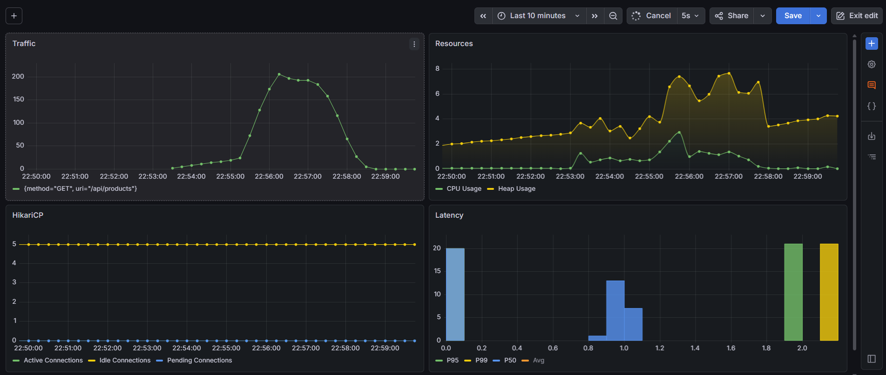
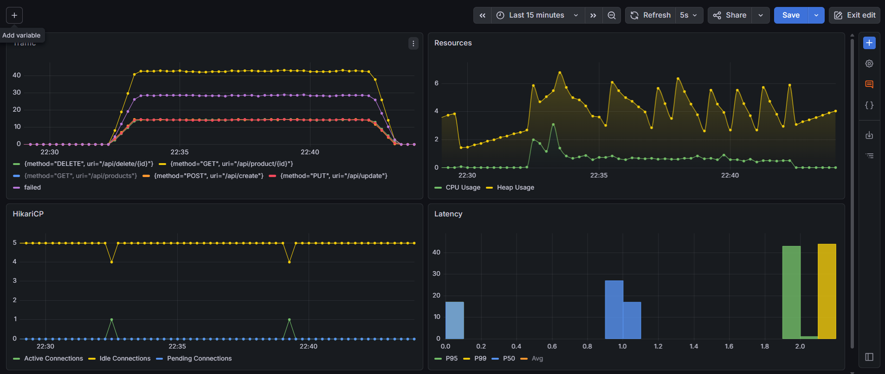

# 🚀 Performance Testing Framework

A containerized performance testing framework built with **k6**, **Prometheus**, and **Grafana**, designed for scalable, reproducible, and observable load testing.

It provides a full observability stack for executing performance tests, collecting metrics, and visualizing system behavior under load.

---

# 📌 Overview

This framework integrates multiple components to enable end-to-end performance testing and monitoring:
- **k6** → Load testing engine (JavaScript-based test scenarios)
- **Prometheus** → Metrics collection and time-series database
- **Grafana** → Visualization and dashboards for performance insights
- **Docker Compose** → Environment orchestration and reproducibility

---

## 📄 Project Structure

```text
.
├── Dockerfile
├── commands.sh
├── pom.xml
├── README.md
│
├── docker
│   ├── docker-compose-env.yml
│   └── docker-compose-k6.yml
│
├── monitoring
│   ├── prometheus
│   │   └── prometheus.yml
│   └── grafana
│       ├── datasource.yml
│       └── dashboards
│           └── dashboards.yml
│
├── sample_reports
│   ├── soak
│   │   ├── soak_grafana.png
│   │   └── soak_log.txt
│   └── spike
│       ├── spike_grafana.png
│       └── spike_log.txt
│
├── src
│   ├── main
│   │   ├── java
│   │   │   └── io/github/ptf
│   │   │       ├── controller
│   │   │       │   └── ProductController.java
│   │   │       ├── service
│   │   │       │   └── ProductService.java
│   │   │       ├── repository
│   │   │       │   └── ProductRepository.java
│   │   │       ├── model
│   │   │       │   └── Product.java
│   │   │       └── ApplicationUnderTest.java
│   │   │
│   │   └── resources
│   │       ├── application.properties
│   │       ├── application.yml
│   │       └── data.sql
│   │
│   └── test
│       ├── k6
│       │   ├── main.js
│       │   │
│       │   ├── config
│       │   │   ├── env.js
│       │   │   └── thresholds.js
│       │   │
│       │   ├── scenarios
│       │   │   ├── smoke.js
│       │   │   ├── load.js
│       │   │   ├── stress.js
│       │   │   ├── spike.js
│       │   │   ├── soak.js
│       │   │   └── index.js
│       │   │
│       │   ├── flows
│       │   │   ├── get-all-products.js
│       │   │   └── e2e.js
│       │   │
│       │   ├── services
│       │   │   └── product-service.js
│       │   │
│       │   └── data
│       │       ├── products.js
│       │       └── products.json
│       │
│       └── resources
│           └── Queries.promql
```

---

## Architecture

The framework separates workload definition, business flows, service interactions, and monitoring concerns to provide a scalable and maintainable performance testing solution.

### High-Level Architecture

```text
                        ┌─────────────────────┐
                        │      k6 Runner      │
                        └──────────┬──────────┘
                                   │
                                   ▼
                        ┌─────────────────────┐
                        │     main.js         │
                        │ Scenario Bootstrap  │
                        └──────────┬──────────┘
                                   │
                ┌──────────────────┼──────────────────┐
                ▼                  ▼                  ▼
        ┌─────────────┐    ┌─────────────┐    ┌─────────────┐
        │ Smoke Test  │    │ Load Test   │    │ Stress Test │
        └──────┬──────┘    └──────┬──────┘    └──────┬──────┘
               │                  │                  │
               └──────────────────┼──────────────────┘
                                  ▼
                     ┌─────────────────────┐
                     │     Test Flows      │
                     │  e2e / get products │
                     └──────────┬──────────┘
                                │
                                ▼
                     ┌─────────────────────┐
                     │   Service Layer     │
                     │ Product Service API │
                     └──────────┬──────────┘
                                │
                                ▼
                     ┌─────────────────────┐
                     │ Spring Boot AUT     │
                     │ Product REST API    │
                     └──────────┬──────────┘
                                │
                                ▼
                     ┌─────────────────────┐
                     │      H2 Database    │
                     └─────────────────────┘
```

### Monitoring Architecture

```text
              k6 Metrics
                    │
                    ▼
         ┌──────────────────┐
         │   Prometheus     │
         │ Metrics Storage  │
         └────────┬─────────┘
                  │
                  ▼
         ┌──────────────────┐
         │     Grafana      │
         │ Dashboards       │
         └────────┬─────────┘
                  │
                  ▼
         ┌──────────────────┐
         │ Performance      │
         │ Analysis & KPIs  │
         └──────────────────┘
```

### Test Execution Flow

```text
Scenario
   │
   ▼
Business Flow
   │
   ▼
Service Layer
   │
   ▼
HTTP Request
   │
   ▼
Application Under Test
   │
   ▼
Metrics Collection
   │
   ▼
Threshold Validation
   │
   ▼
Prometheus + Grafana
```

---

# 🧪 Test Environment

## 🖥️ System Under Test (Spring Boot API)
The application under test runs in a container and exposes the following endpoints:
- `GET /api/products` → Retrieve all products
- `GET /api/product/{id}` → Retrieve a product by ID
- `POST /api/create` → Create a new product
- `PUT /api/update` → Update an existing product
- `DELETE /api/delete/{id}` → Delete a product by ID

**Base URL:** http://localhost:8080

---

## 📊 Observability Stack

### Prometheus
- URL: http://localhost:9090
- Config: `/config`
- Targets: `/targets`
- Query UI: `/query`

### Grafana
- URL: http://localhost:3000
- Dashboards: `/dashboards`
- Data sources: `/connections/datasources`

---

## ⚡ Load Testing (k6)

k6 is used to execute different performance test types:
- Smoke
- Load
- Stress
- Spike
- Soak

> ⚠️ k6 runs as a disposable container and is removed after execution.

---

# 🐳 Running with Docker

## ▶️ Start full environment
```bash
docker compose -f ./docker/docker-compose-env.yml up --build --pull always -d
```

## 🧪 Run k6 tests
Example (smoke test):
```bash
docker compose -f ./docker/docker-compose-k6.yml run --rm --pull always -e TEST=smoke k6 -v
```
You can replace smoke with:
- load
- stress
- spike
- soak

## ⛔ Stop environment
```bash
docker compose -f ./docker/docker-compose-env.yml down
```

---

# 📈 Reports
### Spike test:

### Soak test:

